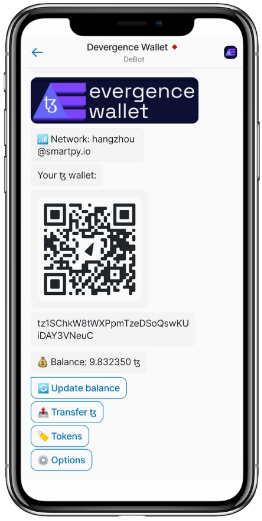
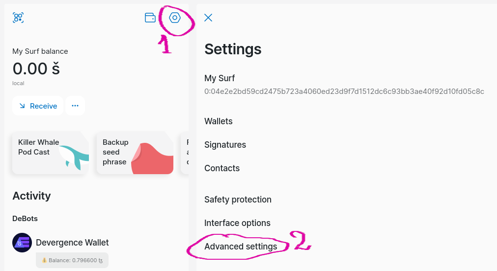
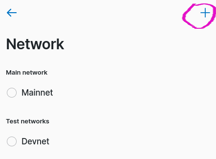
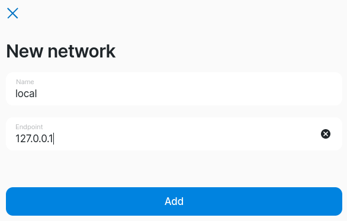

# Devergence Wallet

DEvergence Wallet is an Everscale DeBot for managing a Tezos wallet.

* DeBot address (Everscale Testnet): 
[0:c9ebfa0388497fbeda5b1926b70143db720d484201153b669feac280537f512f](https://uri.ever.surf/debot/0:c9ebfa0388497fbeda5b1926b70143db720d484201153b669feac280537f512f?net=devnet)

* Presenation on YouTube:
https://www.youtube.com/watch?v=sQ-HnldT3jM

## Contents
1. [Description](#description)
2. [Technical details](#technical-details)
    * [Signing schemes](#signing-schemes)
    * [Key derivation issue](#signing-schemes)
    * [Generating Tezos address from a public key](#generating-tezos-address-from-a-public-key)
    * [Signing a message](#signing-a-message)
    * [Sending to the blockchain](#sending-to-the-blockchain)
3. [Compile and deploy](#compile-and-deploy)
    * [Run in Ever Surf from SE node](#run-in-ever-surf-from-se-node)
4. [References](#references)

## Description

Decentralized Bots (or DeBots) are a unique feature of the [Everscale blockchain](https://everscale.network). 
They look like Telegram bots, and allow you to create decentralized applications that reside entirely in 
the blockchain. [Ever Surf](https://ever.surf/) - is currently the most powerful Everscale DeBot browser.

The previous experience of creating DeBots allowed to use them only with the Everscale blockchain.
This project - DeBot for managing a Tezos wallet - shows that Everscale's DeBots can also be used to interact 
with the Tezos blockchain.



Devergence Wallet has the following features:
* Show your address
* Show your balance in TEZ
* Show a QR-code to easily receive transfers
* Transfer TEZ
* Choose the target address manually
* Chose the target address by scanning a QR-code
* Check operation result
* Automatically reveal a public key if required
* Show the list of FA1.2 tokens that belong to your address
* Show the balances of FA1.2 tokens
* Send FA1.2 tokens
* Choose network (2 endpoints added)
* Request tokens using the cross-chain faucet (if deployed and set), see [faucet](faucet)


## Technical details

Managing a Tezos wallet essentially means being able to sign transactions. 
JSON RPC can be used to send a signed transaction to the blockchain.

### Signing schemes

Tezos supports 3 signing schemes. 
For implicit Tezos accounts, you can use the address prefix to determine which 
signature scheme for that account should be used.

The address prefixes and signing schemes as follows [[1]](https://pytezos.baking-bad.org/tutorials/01.html#multiple-elliptic-curves):

| Address prefix  | Signing scheme 
| ----------------|----------------
| tz1             | **Ed25519** - twisted Edwards curve
| tz2             | **Secp256k1** - defined in Standards for Efficient Cryptography, used in Bitcoin, Ethereum, and other cryptocurrencies
| tz3             | **P-256** - a prime elliptic curve standardised by NIST (Also known as secp256r1)


At the same time, the **Ed25519** elliptic curve is natively used in Everscale.

Everscale DeBots are capable of signing arbitrary data with your account private key,
and communicating via HTTP using POST and GET requests. There is also an interface that
helps you to parse JSON data in a DeBot.

This all enables an Everscale DeBot to sign a Tezos operation and send them to the Tezos blockchain.


### Key derivation issue

Both Tezos and Everscale use [BIP-39](https://github.com/bitcoin/bips/blob/master/bip-0039.mediawiki)
standard for mnemonic phrase with the same dictionary.
BIP-39 describes how the mnemonic phrase is converted into a binary representation (seed).

Then, the seed is used to derive the master key. However, the master keys in Everscale and 
Tezos are calculated differently from the seed (see the Python pseudocode below).

* In Everscale:
```python
hmac_sha512(b"Bitcoin seed", seed)
```

* In Tezos:
```python
hmac_sha512(b"ed25519 seed", seed)
```

Then, the master key is used to derive a signing keys with 
[BIP-44](https://github.com/bitcoin/bips/blob/master/bip-0044.mediawiki) standard.
BIP-44 defines a derivation path for [hierarchical deterministic wallets](https://github.com/bitcoin/bips/blob/master/bip-0032.mediawiki).

The following derivation paths are used in Tezos and Everscale for default accounts:
* Everscale: `m/44'/396'/0'/0/0`
* Tezos: `m/44'/1729'/0'/0'`

Surf wallet currently doesn't allow to change the derivation path, either import a custom
keypair. Even though Tezos wallets like [Temple](https://templewallet.com/) allows you to set
a custom derivation path, the master keys are still different and the derived signing keys will
also be different in Tezos in Everscale for the same mnemonic.

Therefore, it is impossible to use Ever Surf for managing an existing Tezos account create in
popular Tezos wallets such as Temple.

However, it is still possible [export your private key](export_keys) from Surf and use it in any other wallet.
For this purpose we implemented a small [Python script](export_keys).


### Generating Tezos address from a public key

To receive transfers, you first need to known your Tezos address.

The address in Tezos is obtained by hashing the public key and prepend it with the specific prefix
depending on the used signature scheme. The result is then base58-encoded.

The main hashing algorithm in Tezos is **Blake2b** which is absent in Everscale DeBots interfaces,
and was implemented in our DeBot, as well as base58-encoding (see [blake2b](blake2b)). 

The [list of prefixes](https://pytezos.baking-bad.org/tutorials/01.html) for different signing 
schemes in Tesos is as follows:

| Signature scheme | Hash prefix    | Encoded prefix  | Blake2b Digest size
| -----------------|----------------|-----------------|--------------------
| Ed25519          | `\x06\xa1\x9f` | tz1             | 20
| Secp256k1        | `\x06\xa1\xa1` | tz2             | 20
| P-256            | `\x06\xa1\xa4` | tz3             | 20

As Everscale uses Ed25519 for signing, the prefix should be `\x06\xa1\x9f` and the address starts with `tz1`.

Finally, we can obtain Tezos address the public key as follows (python pseudocode):
```python
pubkey_hash = blake2b(sign_keys.public.encode(), digest_size=20).digest()
tezos_address = b58encode_check(b"\x06\xa1\x9f" + pubkey_hash).decode()
```


### Signing a message

When you prepared a transaction you should first convert it into binary form.
In Tezos, this operation is called "forge". To sign a forged transaction you 
should calculate `blake2b` hash of it with the digest size of 32 bytes.
The process of creating and forging a transaction, as well as how to send a transaction
to the blockchain using JSON RPC is described in [Tezos client abstract contracts and libraries](lib)

Everscale DeBot can sign messages without having to operate the private key or the seed phrase, 
which remain hidden from the DeBot.
This helps to keep your private key and seed phrase safe.

In the DeBot, the function `signHash` of the 
[Sdk Interface](https://github.com/tonlabs/DeBot-IS-consortium/tree/main/Sdk) is used to sign a hash:

```solidity
function OnForge(bytes forged_transaction) public {
    // calculate blake2b hash with the digest size of 32 bytes
    Blake2b.digest(tvm.functionId(OnTxHash), forged_transaction, 32);
}

function OnTxHash(uint256 hash) public {
    // Sign the transaction hash
    Sdk.signHash(tvm.functionId(setSignature), m_sbHandle, hash);
}

function setSignature(bytes signature) public {
    // we need both binary representation of the signature and base58-encoded value
    binary_sig = signature;
    base58_sig = Base58.b58encode(signature, Base58.PREFIX_edsig);
    // next, send the message and its signature to the blockchain
}
```


### Sending to the blockchain

Tezos nodes support JSON RPC protocol to work with the blockchain.
Everscale DeBots can interact with HTTP servers using the 
[Network Interface](https://github.com/tonlabs/DeBot-IS-consortium/tree/main/Network):

```solidity
function rpc_blocks_hash() internal {
    Network.get(
        tvm.functionId(onRpcResponse), 
        "https://hangzhounet.smartpy.io/chains/main/blocks/head", 
        ["Content-Type: application/json"]
    );
}
```

The answers in JSON format can be parsed using
[Json Interface](https://github.com/tonlabs/DeBot-IS-consortium/tree/main/Json).

You can find more details here: [Tezos client abstract contracts and libraries](lib)


## Compile and deploy

In order to compile and deploy to the local `SE node` please do the following:

1. Install `everdev` and `TON OS Startup Edition` following the 
instructions: https://github.com/tonlabs/everdev
2. Run `TON OS Startup Edition`:
```shell script
everdev se start
```
3. Deploy `Blake2b` contract:
```shell script
./blake2b/deploy.sh
```
Blake2b contract should be deployed at the address `0:438bae75507a67b40169e0b366490c9d22298e44ef7b98cd3c4bf215e2d4103b`

If the address is different, please change it in [blake2b/IBlake2b.sol](blake2b/IBlake2b.sol).

4. Compile the Devergence Wallet DeBot:
```shell script
everdev sol compile ./WalletBot.sol
```

5. Deploy the Devergence Wallet DeBot:
```shell script
./deploy_bot.sh
```
The script will provide you the DeBot address.


### Run in Ever Surf from SE node

- Open https://web.ever.surf in a web browser.
- Create a new wallet if you don't have it
- Go to Settings (1) and click **Advanced settings** (2):


- Click **Network**
- Click on the `+` sign in the top right corner:


- Add local node:


- Now you can run the DeBot deployed at your local SE node (use the address provided you 
by the `./deploy_bot.sh` script)


## References
1. https://pytezos.baking-bad.org/tutorials/01.html#multiple-elliptic-curves
2. https://github.com/bitcoin/bips/blob/master/bip-0039.mediawiki
3. https://github.com/bitcoin/bips/blob/master/bip-0044.mediawiki
4. https://github.com/bitcoin/bips/blob/master/bip-0032.mediawiki
5. https://pytezos.baking-bad.org/tutorials/01.html
6. [Tezos client abstract contracts and libraries](lib)